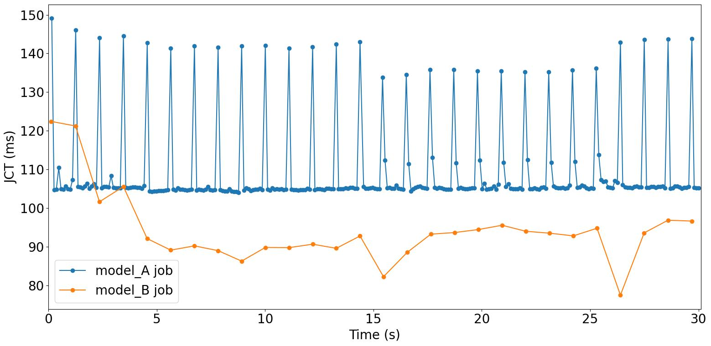

# Deft
## Installation
- Clone the repository  
`git clone git@github.com:yitianhao/gpu_sched_new.git`

- Create a python virtual environment named "gpushare" with `conda`. If `conda` is missing, please
try to install [miniconda](https://docs.conda.io/en/main/miniconda.html), which
includes conda.
    ```
    cd gpu_sched_new
    conda create env -f env.yml
    ```
- Once the conda virtual environment is set, replace `transform.py` file in 
torchvision library in the virtual environment with `transform.py` in the 
project root directory. 
    ```
    # activate virtual env
    conda activate gpushare 

    # backup original transform.py
    cp $CONDA_PREFIX/lib/python3.9/site-packages/torchvision/models/detection/transform.py \
       $CONDA_PREFIX/lib/python3.9/site-packages/torchvision/models/detection/transform_orig.py

    # copy transform.py into torchvision
    cp transform.py \
       $CONDA_PREFIX/lib/python3.9/site-packages/torchvision/models/detection/transform.py
    ```

- Compile hooks library which intercepts CUDA calls.
    ```
    cd gpu-sched-exp/intercept-lib
    make
    ```
- Compile the helper library.
    ```
    cd gpu-sched-exp/pytcppexp
    make
    ```
## Example

### Create a configuration file
The configuration file in Json format specifies which DNN models to run, job
workload metadata, and some control knobs. 
Take a look at [input.json](./gpu-sched-exp/gpu-tester/exp_configs/input.json).

### Run
Run the following commands to run an experiment in which two fasterrcnn_resnet50_fpn
run object detection jobs sharing one GPU without job preemption.
```
cd gpu-sched-exp/gpu-tester  # python scripts have to be run under this dir
python src/run_exp.py -f exp_configs/input.json
```

### Plot
Run the following commands to plot the experiment results and an figure should
be generated like the one blow.
```
cd gpu-sched-exp/gpu-tester
python src/plot_jct_timeseries.py \
 --model-A-jct-log logs/model_A.csv \
 --model-B-jct-log logs/model_B.csv
```


