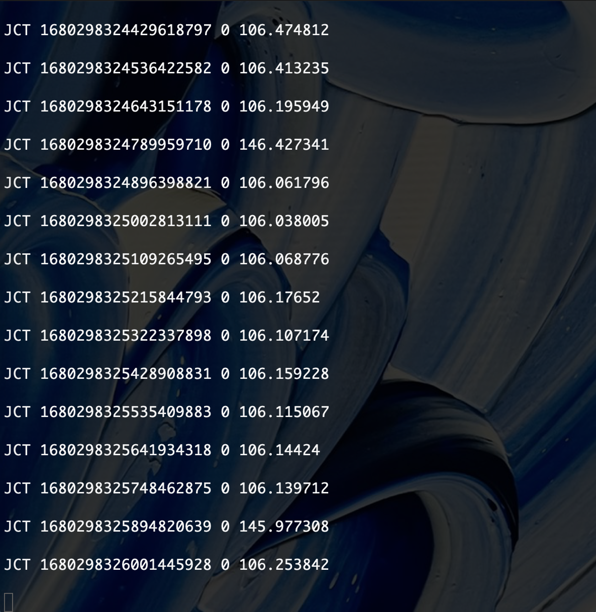
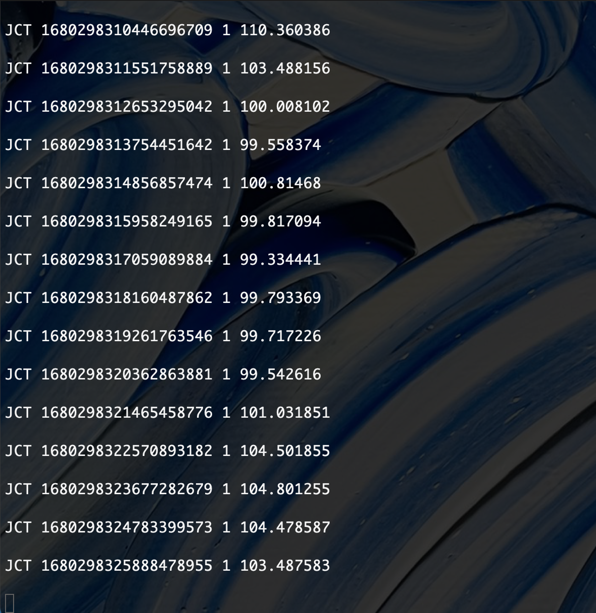
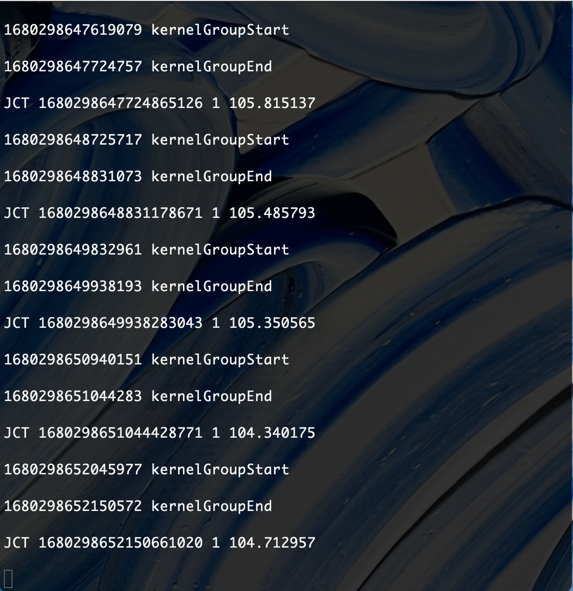
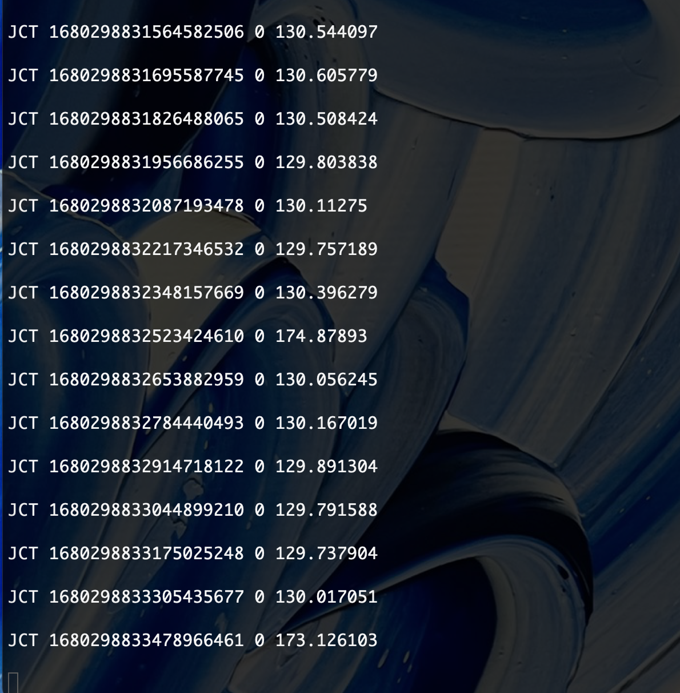
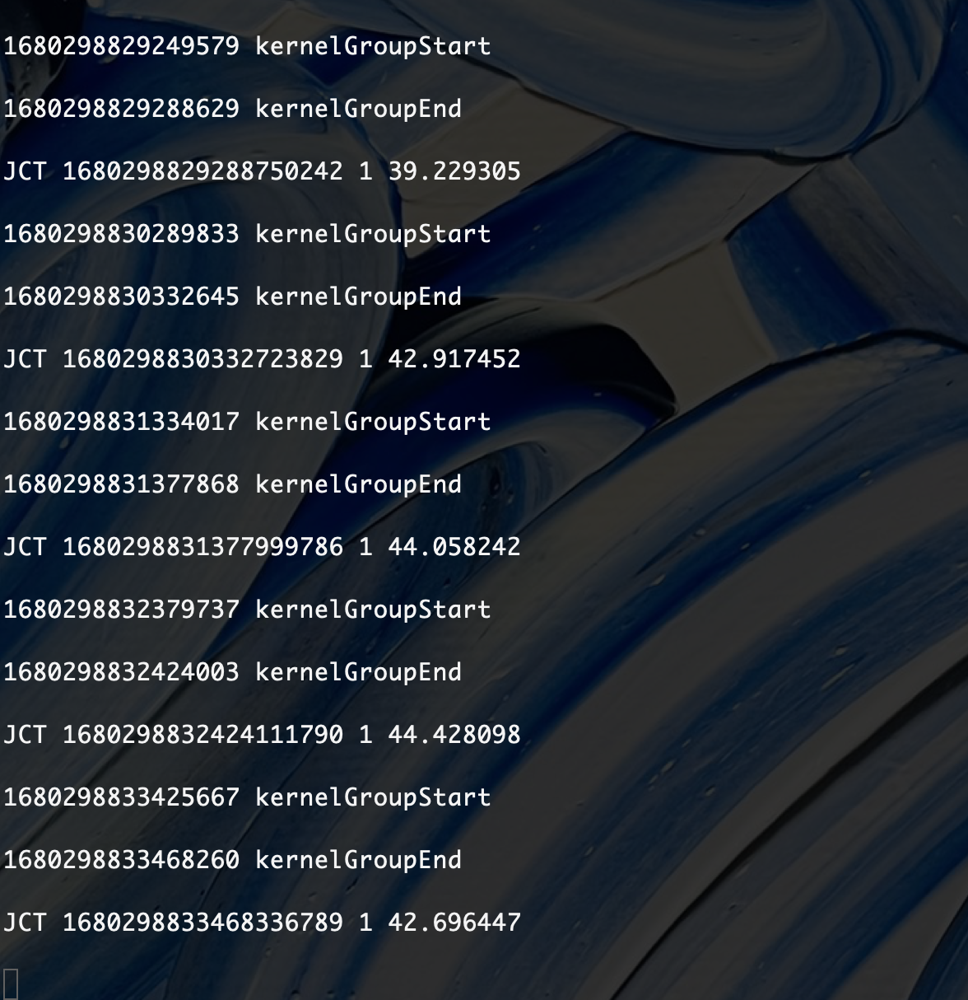
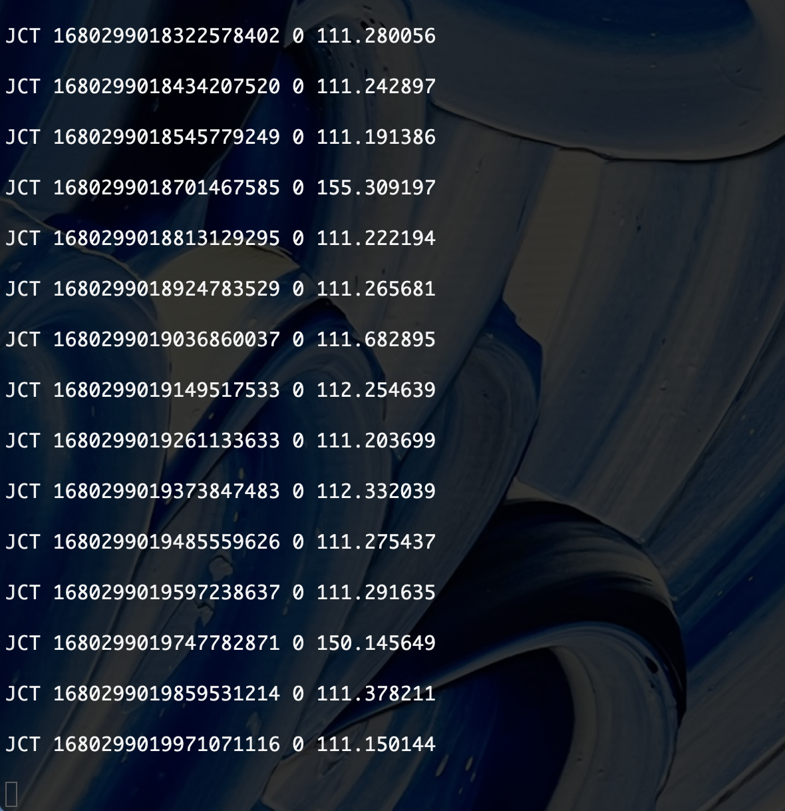
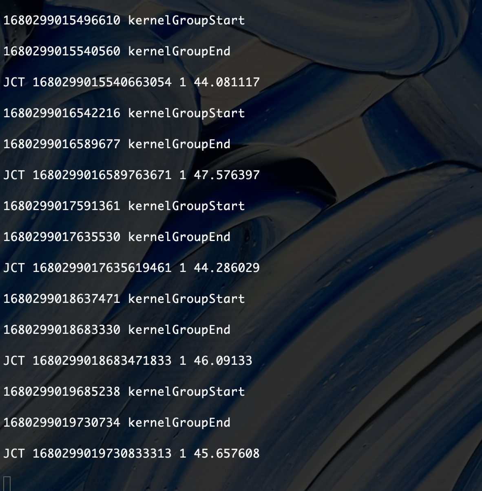
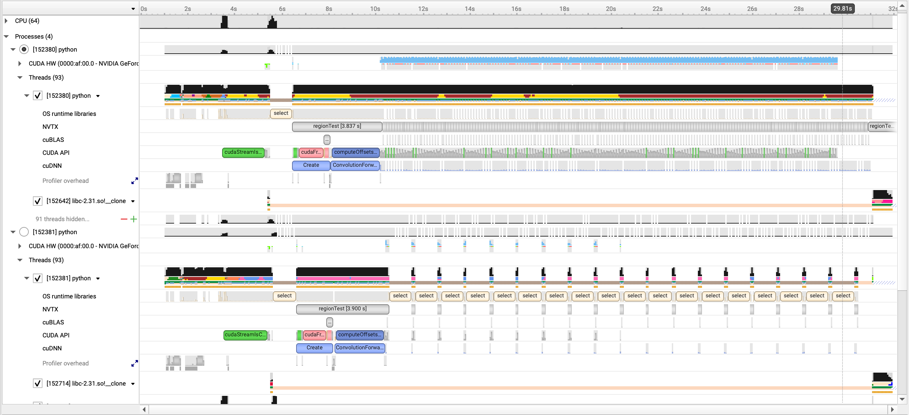

## To Setup the gpu sharing experiment 
0. You have already setup conda environment and replace transform.py file in torchvision with `gpu-core-exps/transform.py`. The path of the file that should be replaced is under `/home/USERNAME/miniconda3/envs/torch/lib/python3.9/site-packages/torchvision/models/detection/transform.py`

1. Make sure under `/dev/shm/`, `MySharedMemory3, named_cnd3, sem.named_mutex3` does not exist or owned by you. If they exist and not own by you, delete them using root privilage.

2. Compile `expcontroller` under `gpu-core-exps/gpu-sched-exp/pytcppexp`. This module provides initialization script of SharedMemory, Mutex, and conditional variable files. `libgeek.so` will also be built. It is a dynamic library that will be used by PyTorch process to modfiy SharedMemroy.\
`./make.sh`

3. Compile hooks library under `gpu-core-exps/gpu-sched-exp/intercept-lib/`\
`./make.sh`\
This command will create three versions of hooks library: controller, controller + sync, and controller + event group.


## To configure the gpu sharing experiment 
```json
{
	"models": [
		{
			"model_name": "fasterrcnn_resnet50_fpn",
			"model_weight": "FasterRCNN_ResNet50_FPN_Weights",
			"sleep_time": 0,
			"input_file_path": "../data-set/rene/0000000099.png",
			"output_file_path": "./logs",
			"output_file_name": "model_A",
			"priority": 0,
			"resize": true,
			"resize_size": [1440, 2560],
			"control": {
				"control": true,
				"controlsync": true,
				"controlEvent": false,
				"queue_limit": {
					"sync": 1,
					"event_group": 2
				}
			}
		},
		{
			"model_name": "fasterrcnn_resnet50_fpn",
			"model_weight": "FasterRCNN_ResNet50_FPN_Weights",
			"sleep_time": 1,
			"input_file_path": "../data-set/rene/0000000099.png",
			"output_file_path": "./logs",
			"output_file_name": "model_B",
			"priority": 1,
			"resize": false,
			"resize_size": [720, 1280],
			"control": {
				"control": true,
				"controlsync": false,
				"controlEvent": false,
				"queue_limit": {
					"sync": 0,
					"event_group": 2
				}
			}
		}
	],
	"exp_dur": 30,
	"device_id": 1
}

```
1. Under `exp_configs/gpu-tester/`, there are example configuration file for running gpu sharing experiment. The json file shown above is `input.json`, where it defined running a FasterRCNN 1440P with normal FasterRCNN on the same GPU.
The `exp_dur` field defines the length of this experiment in seconds.<br /> 
`device_id` defines the id of the GPU that models are loaded and their inferences would run.(We have 2 GPU in ziyizhang server and I choose to let my experiment run on the GPU with ID 1).<br />
`models` is an array of configurations for models to be run. There should be at least one model's configuration defined.<br />
Let's look closer at an individual model's configuration.
```json
        {
			"model_name": "fasterrcnn_resnet50_fpn",
			"model_weight": "FasterRCNN_ResNet50_FPN_Weights",
			"sleep_time": 0,
			"input_file_path": "../data-set/rene/0000000099.png",
			"output_file_path": "./logs",
			"output_file_name": "model_A",
			"priority": 0,
			"resize": true,
			"resize_size": [1440, 2560],
			"control": {
				"control": true,
				"controlsync": true,
				"controlEvent": false,
				"queue_limit": {
					"sync": 1,
					"event_group": 2
				}
			}
		}
```
`model_name`, `model_weight` are required to be pretrianed models that can be found under `torchvision.models`, `torchvision.models.detection`, and `torchvision.models.segmentation` sub-packages. You can also import more sub-packages or add your own pretrained model but I haven't tried that in the run_exp.py script.<br />
`sleep_time` defines the sleep time in seconds between consecutive inference job of this model.(Here it is 0 which meand jobs are launched )\
`input_file_path` defines the path to the single image that will be fed to this model.\
`output_file_path` defines the path to the model's output logs. It will create directories if missing.\
`output_file_name` defines the name of the output file. The final output file will be `{output_file_name}.log`\
`priority` defines whether this model will be preempted to give way to later inserted job (Both inserted job's and preempted jobs's `control.control` must be `true`, otherwise this setting will not take effect). Right now the controller only support two priority level: `0` as the low priority job that will be preempted by job with `1` priority. \
`resize` can be `true` indicating the model's input resoluation will be scaled to `resize_size`.\
`control` block defines configurations for controlling polices:
`control.control` must be `true` to enable the following configurations since `control.control=false` means not using hooks and controller while running this model's inferences.\
`control.controlsync=true` means we will apply the hooks with synchronization points added periodically(`control.queue_limit.sync` kernels per synchronization point) to the model's inference jobs.\
`control.controlEvent=true` means we will apply the hooks with event group technique(`control.queue_limit.event_group` kernels per group) to the model's inference jobs.\
When both `control.controlEvent=true` and `control.controlsync=true`, only `control.controlEvent=true` take effects. We do not support applying both event group and synchronization point methods to a model at this point.\

## To run the gpu sharing experiment 

Run experiment: `python run_exp.py -f exp_configs/input.json`.<br /> 

Replace `exp_configs/input.json` with path to your experiment configuration file. This command runs the experiment of one or multiple models sharing one GPU. Each model has a output file logged at location defined in the configuration file. There files contains JCT information and can be used for further analysis.
At the same time `models_pid.json` will be created. It contains mapping from `model_name` to its process id in the experiment. 

Run experiment with NSight report: `nsys profile -w true -t cuda,nvtx,osrt,cudnn,cublas -s cpu -o nsight_report -f true -e --cudabacktrace=true -x true python run_exp.py -f exp_configs/input.json`.<br />

Replace `exp_configs/input.json` with path to your experiment configuration file. This command runs the experiment of one or multiple models sharing one GPU. Each model has a output file logged at location defined in the configuration file. There files contains JCT information and can be used for further analysis. In addition, there will be a nsight report generated: `nsight_report.nsys-rep`. You can open the report with NSight System GUI directly or copy the report and `models_pid.json` to `gpu-core-exps/gpu-sched-exp/nsight-parser` for a parser script that summarize kernel-level information for each model.  

## Expected Outputs
Run the experiment using `exp_configs/input.json`, which is FasterRCNN 1440P and FasterRCNN sharing the GPU.
FasterRCNN 1440P's JCT logs (logs/model_A.log):\
 
FasterRCNN's JCT logs (logs/model_B.log):\
 

Run the experiment using `exp_configs/input_control.json`, which is FasterRCNN 1440P and FasterRCNN using controller sharing the GPU.
FasterRCNN 1440P's JCT logs (logs/model_A.log):\
 
FasterRCNN's JCT logs (logs/model_B.log):\
 

Run the experiment using `exp_configs/input_controlsync.json`, which is FasterRCNN 1440P and FasterRCNN using controller  and  FasterRCNN 1440P is inserted synchronization point every 1 kernel sharing the GPU.
FasterRCNN 1440P's JCT logs (logs/model_A.log):\
 
FasterRCNN's JCT logs (logs/model_B.log):\
 

Run the experiment using `exp_configs/input_controlevent.json`, which is FasterRCNN 1440P and FasterRCNN using controller  and  FasterRCNN 1440P is using event group technique(groupsize 2) sharing the GPU.
FasterRCNN 1440P's JCT logs (logs/model_A.log):\
 
FasterRCNN's JCT logs (logs/model_B.log):\
 

Run the experiment using `exp_configs/input.json` and Nsight, which is FasterRCNN 1440P and FasterRCNN sharing the GPU.
Expected NSight Report:
 